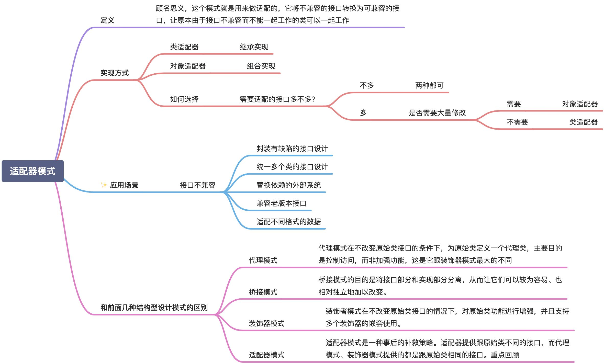

# 【适配器模式】心得

## 这个模式核心是什么？其实讲的是什么？

它将不兼容的接口转换为可兼容的接口，让原本由于接口不兼容而不能一起工作的类可以一起工作。

## 给我什么启发？学到了什么？

## 我以前写过的什么代码场景也许可以用这个重构？大概思路？

一个功能有多个输入，比如一个功能需要输入一个文件，但是这个文件可能是一个txt，也可能是一个pdf，那么就需要一个适配器来适配这个文件。
